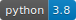

# BATMAN (BAyesian Toolkit for Machine learning ANalysis) pacakage
<!-- README.md -->

## Installation

As this is a dev version for installing BATMAN package you have to download the source doing:

`git clone https://github.com/Martindelosrios/BATMAN.git`

Then, in the BATMAN directory just do

`pip install .`

Soon you will be able to do

`pip install BATMAN`

## Tutorial

In [Examples](https://github.com/Martindelosrios/BATMAN/tree/master/EXAMPLES) you can find some examples to start playing with BATMAN

## Developed by:

Martín de los Rios  
 (martindelosrios13@gmail.com)

Andrés Daniel Perez 

David Cerdeño 
