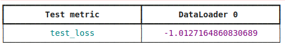

.. raw:: html

    
    
.. role:: red

Examples
--------

First we need to load some needed libraries

.. code-block:: python

    from CADDENA import caddena, models
    import numpy as np
    import matplotlib.pyplot as plt
    import matplotlib as mpl
    import h5py
    import pkg_resources
    from importlib_resources import files
    
    from scipy.integrate import trapezoid
    from matplotlib.lines import Line2D

Now we need to load some data to play with.
You can load your own data, or load the testset used in XXXX.XXXXX

.. code-block:: python

    ref = files("CADDENA") / "dataset/"
    DATA_PATH = str(ref)
    with h5py.File(DATA_PATH + "/testset.h5", "r") as data:
      x_norm_rate  = data['x_norm_rate'][()]
      x_norm_drate = data['x_norm_drate'][()]
      x_norm_s1s2  = data['x_norm_s1s2'][()]
      pars_norm    = data['pars_norm'][()]
      pars_min = data.attrs["pars_min"]
      pars_max = data.attrs["pars_max"]
      x_min_rate = data.attrs["x_min_rate"]
      x_max_rate = data.attrs["x_max_rate"]
      x_min_drate = data.attrs["x_min_drate"]
      x_max_drate = data.attrs["x_max_drate"]
    

Now we can start playing with CADDENA!!!

Let's pick some random synthetic observation from the dataset:

.. code-block:: python

    i = np.random.randint(len(pars_norm))
    print('nobs = ' + str(i))
    
    pars_true   = pars_norm[i,:]
    x_obs_rate  = x_norm_rate[i,:]
    x_obs_drate = x_norm_drate[i,:]
    x_obs_s1s2  = x_norm_s1s2[i,:].reshape(1,96,96)
    
    M_DM_real = 10**(pars_true[0] * (pars_max[0] - pars_min[0]) + pars_min[0])
    print('M_DM = {:.2f} GeV'.format(M_DM_real))
    sigma_real = 10**(pars_true[1] * (pars_max[1] - pars_min[1]) + pars_min[1])
    print('sigma = {:.3e} cm2'.format(sigma_real))
    theta_real = (pars_true[2] * (pars_max[2] - pars_min[2]) + pars_min[2])
    print('theta = {:.3} '.format(theta_real))

In order to analyse the observations you need to train your models, or 
equivalently to load some pre-trained weights.
For using the models trained in XXXX.XXXX you can do:

.. code-block:: python

    models.XENONnT_O1_rate.load_weights()
    models.XENONnT_O1_drate.load_weights()
    models.XENONnT_O1_s1s2.load_weights()

When doing that you should see something like...

:red:`WARNING: THE NUMERICAL VALUE MAY CHANGE AS IT IS AN STOCHASTIC VARIABLE`

Now we need to sample the parameters from a choosen prior.

.. code-block:: python

    pars_prior = np.random.uniform(low = 0, high = 1, size = (100_000, 3))

As you can see, you need to specify the prior in the normalized space!
This will be re-normalized to the corresponding physical values internally.

And finally we can compute the likelihood-to-evidence ratios

.. code-block:: python

    logratios1D, logratios2D = caddena.ratio_estimation([x_obs_rate, x_obs_drate, x_obs_s1s2], pars_prior, [models.XENONnT_O1_rate, models.XENONnT_O1_drate, models.XENONnT_O1_s1s2])
    

#. The first argument is a list with the observation that will be analyzed.
#. The second argument is the sample of parameters that will be paired with the observations.
#. The third argument is a list with the models that will be used.

:red:`The first element of the observation list will be analyzed with the first element of the model list, 
and so on, so they need to have the correct shape!!`

You can also check and play with this example in `google colab <https://github.com/Martindelosrios/CADDENA/blob/master/EXAMPLES/Example_1_colab.ipynb>`_
